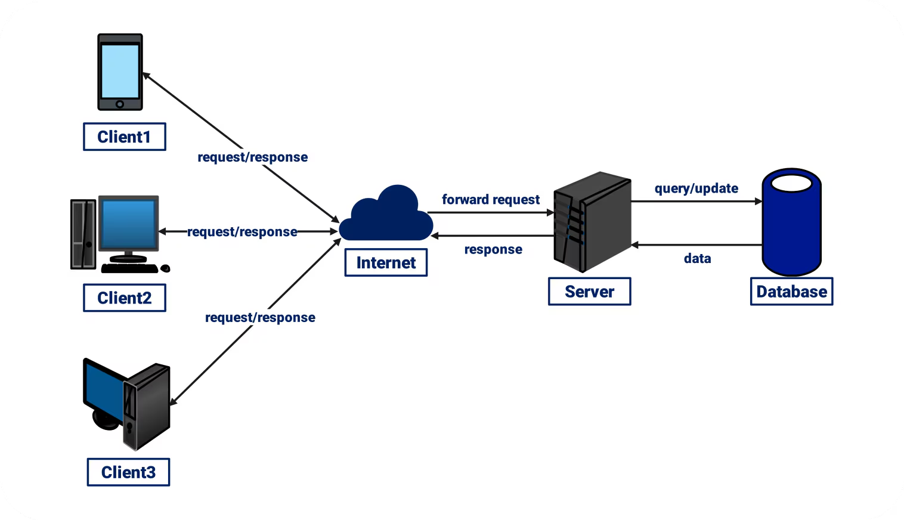

# NUMÉRIQUE POUR TOUTES

## Atelier d'initiation au back end

### Durée :

30 minutes
***

## Installation et lancement du projet

### Pré-requis :

- IDE (IntelliJ, Eclipse...)
- Node.js (pour l'installer : https://nodejs.org)

### Initialisation

Dans le dossier du projet, exécuter dans le terminal :

   ```bash
   npm init -y
   npm install
   ```

### Lancement de l'application

   ```bash
   npm run dev
   ```

Puis dans le navigateur, accéder à cette adresse : `http://localhost:3000`
***

## Objectif de l'atelier

- Expliquer l'architecture Client-Serveur
- Introduire et initier au développement back end

***

## Architecture " client-serveur "


(*Source : https://images.wondershare.com/edrawmax/templates/network-diagram-for-client-server.png*)
***

## Initiation au coding

Le but de l'exercice est de modifier le code existant afin d'y ajouter de nouvelles fonctionnalités.

### Exercice n°1 : Afficher le mot de passe dans la console

*Il est possible d'afficher des informations côté client dans un outil qu'on appelle la console, grâce à des méthodes
comme console.log(), console.info(), console.error(), etc.*  
*On utilise en général la touche F12 dans le navigateur pour afficher cette console.*

**> Consigne**  
Se baser sur le code existant pour afficher dans la console le mot de passe envoyé par le client.

### Exercice n°2 : Ajouter la vérification du mot de passe à l'authentification

*Lors de l'authentification par nom et mot de passe, actuellement seul le nom est vérifié.*  
**> Consigne**  
Se baser sur le code existant pour mettre en place la vérification du mot de passe également.

### Exercice n°3 : Ajouter un message d'erreur dans la méthode

*Dans la méthode calculerAge(), aucune information n'est retournée par le serveur en cas d'erreur.*

**> Consigne**  
Ajouter un message d'erreur permettant d'informer le client de la nature de l'erreur rencontrée.

### Exercice n°4 : Supprimer le mot de passe et ajouter l'âge dans les données envoyées au client

*Une fois la base de données interrogée et la concordance établie entre le nom et le mot de passe reçus, la base de
données envoie les informations de l'utilisateur vers le client en repassant par l'intermédiaire du serveur : c'est la
variable " donneesUtilisateur ".*  
*Pour sécuriser l'application, il ne faut pas que le mot de passe soit retourné dans donneesUtilisateur.*
*Et le client a besoin de l'âge de l'utilisateur afin de pouvoir l'afficher sur le profil.*

**> Consigne**  
En se basant sur le code existant et se servant de la méthode **calculerAge**, modifier la variable **donneesUtilisateur
** pour qu'elle réponde à ces deux exigences.

### Exercice n°5 : Trouver la méthode permettant de formatter du texte en minuscules

*Il existe une multitude de méthodes " prêtes à l'emploi " qui permettent de transformer les données utilisées par
l'application.*

**> Consigne**  
Trouver les méthodes permettant de formatter le texte dans le console.log() selon les consignes suivantes :

- Mettre le texte en minuscules
- Mettre le texte en majuscules
- Tronquer le texte pour n'afficher que les 3 premiers caractères
- Afficher le nombre de caractères que contient le texte

